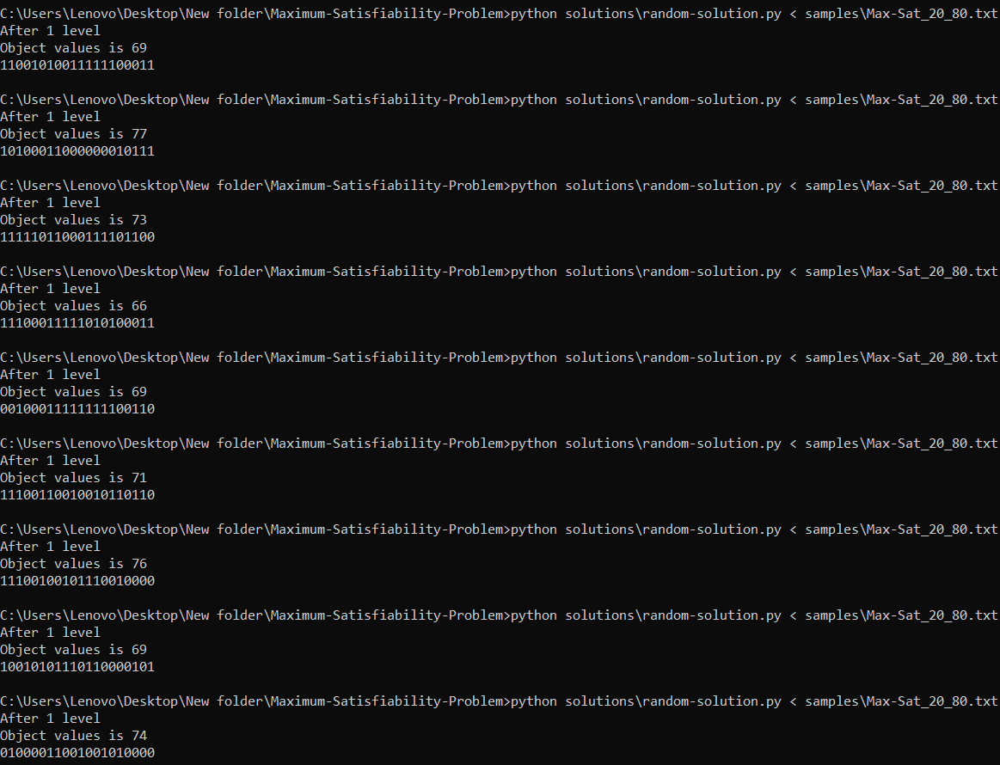
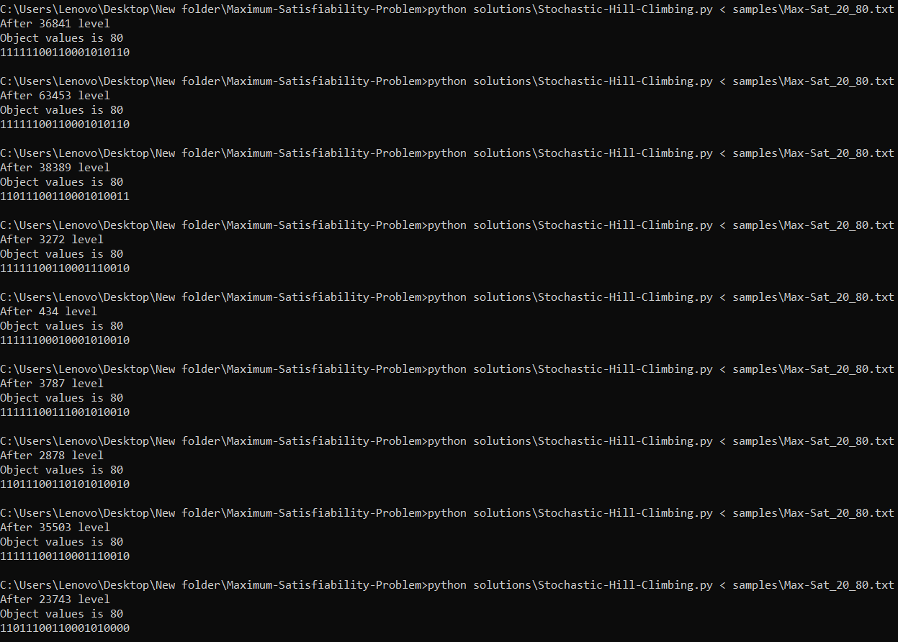
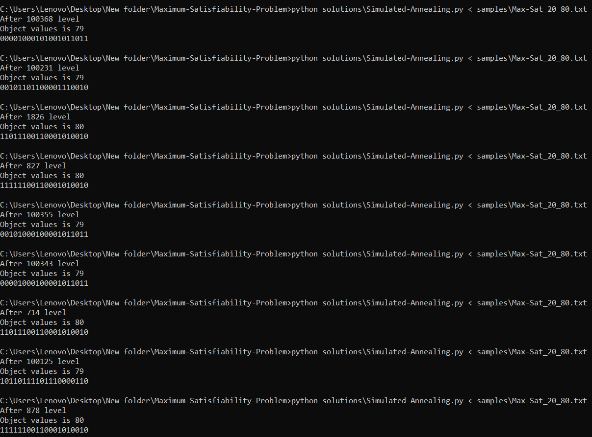
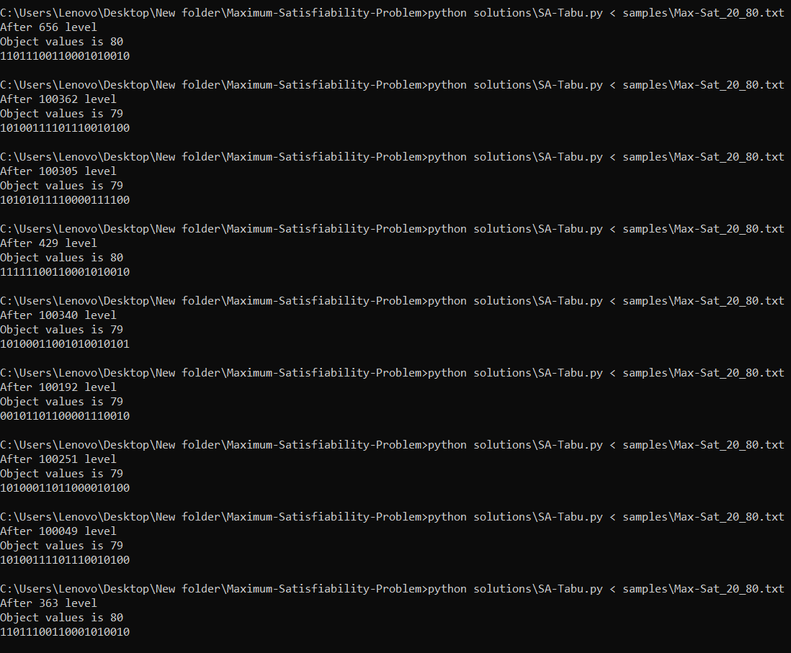

# Maximum-Satisfiability-Problem
Solving problem SAT with the help of "Stochastic local search" algorithms
## What is SAT
In computational complexity theory, the maximum satisfiability problem (MAX-SAT) is the problem of determining the maximum number of clauses, of a given Boolean formula in conjunctive normal form, that can be made true by an assignment of truth values to the variables of the formula. It is a generalization of the Boolean satisfiability problem, which asks whether there exists a truth assignment that makes all clauses true.
[For more details](https://en.wikipedia.org/wiki/Maximum_satisfiability_problem)

## Algorithms
#### 1) Random
In this algorithm, we generate a completely random state, obtain its objective value and report it to the user.

#### 2) [Stochastic Hill Climbing](https://en.wikipedia.org/wiki/Stochastic_hill_climbing)

#### 3) [Simulated Annealing](https://en.wikipedia.org/wiki/Simulated_annealing)

#### 4) SA-Tabu
In this algorithm, we try to solve the problem by combining two algorithms ***[Simulated Annealing](https://en.wikipedia.org/wiki/Simulated_annealing)*** and ***[Tabu search](https://en.wikipedia.org/wiki/Tabu_search)***

